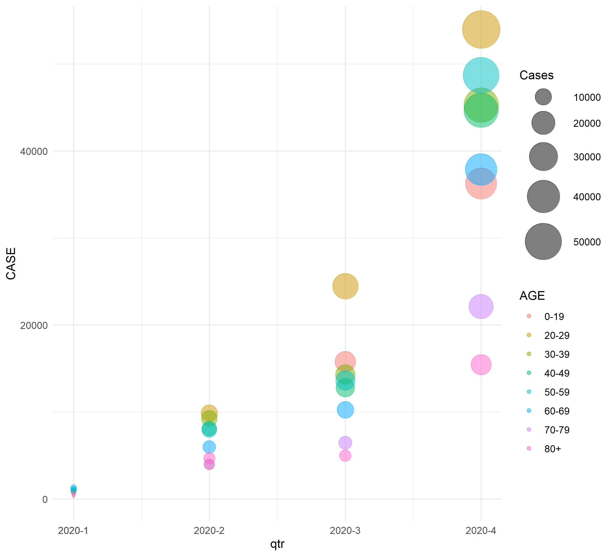

```{r setup, include=FALSE}
knitr::opts_chunk$set(echo = FALSE)
```


```{r echo=FALSE, fig.align ='right', layout = "l-page", fig.cap="Ohio Statehouse"}
knitr::include_graphics("levlong.jpg")
```


# Ohio COVID-19 Cases, Hospitalizations and Deaths by Age and Quarter

The following bubble graph displays the number of COVID-19 infections by age and quarter. Each age cohort is represented by separate colors as noted in the legend to the right. This figure shows that persons between the ages of 20 through 29 account for more infections than the other age groups. Overall infections have increased and apparently have not yet peaked. 

```{r echo=FALSE, fig.align ='right', fig.cap="Infections by Age and Quarter"}

```


The final graph shows deaths by age and quarter. In this figure we see an overwhelming number of COVID-19 fatalities are accounted for by very elderly Ohioans. While it is widely known that the elderly are most susceptible to COVID-19, it is also true that middle-aged persons with significant underlying diseases like respiratory disorders and diabetes are vulnerable to serious harm. Interestingly, overall deaths peaked earlier in the pandemic and have yet to reach previous totals. 


```{r echo=FALSE, fig.align ='right',fig.cap="Deaths by Age and Quarter"}

```

We are now in the third wave of infections, and while the ratio of deaths to infections is lower than what was seen in previous waves, it is possible that the sheer number of new infections and hospitalizations may overwhelm our healthcare system and cause unacceptably high death rates. Ohio will likely see peak pandemic numbers over the next several weeks. These data were extracted from the Ohio Department of Health COVID-19 Dashboard.^[COVID-19. (2020). Retrieved 6 December 2020, from https://coronavirus.ohio.gov/wps/portal/gov/covid-19/home]
