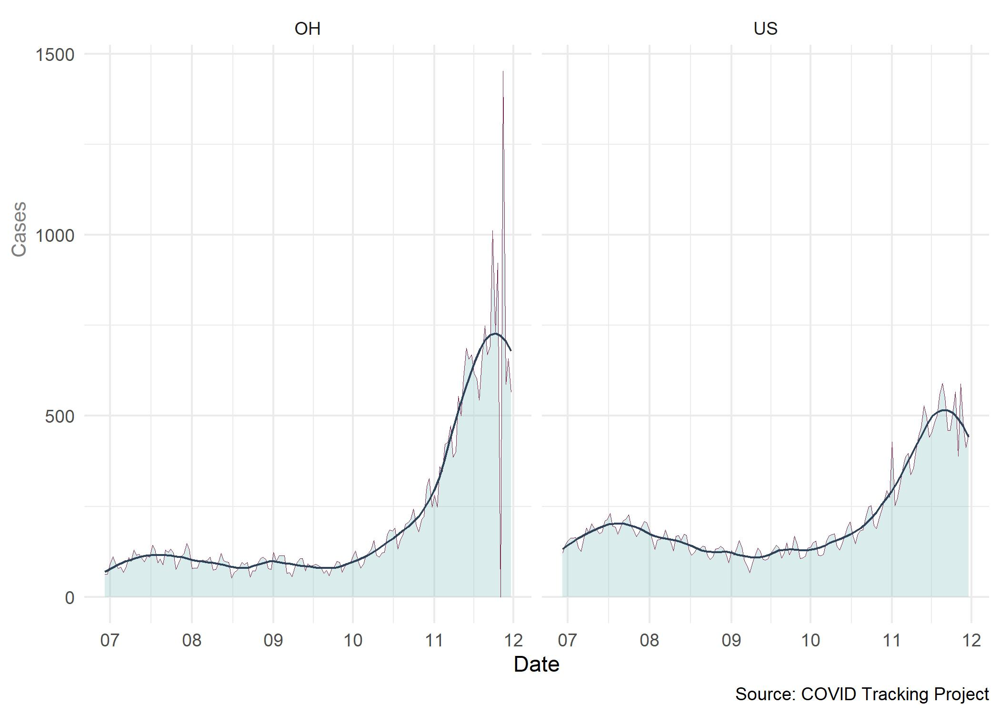
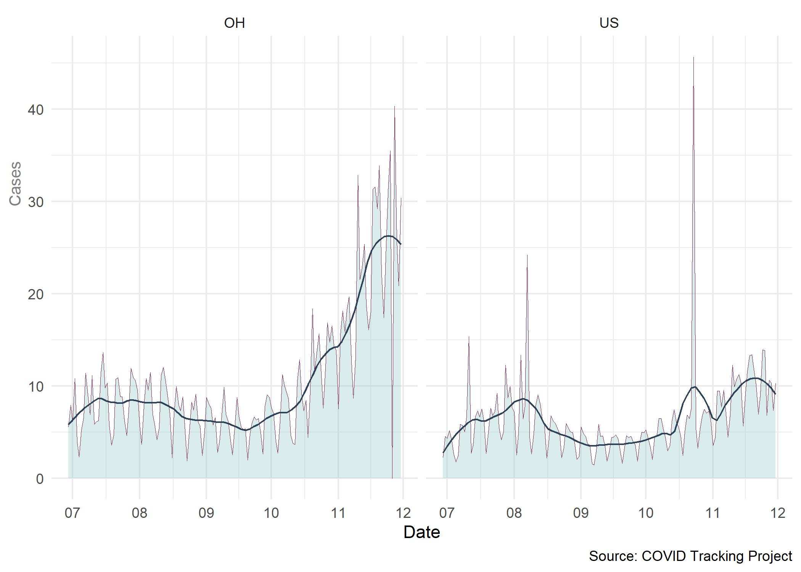
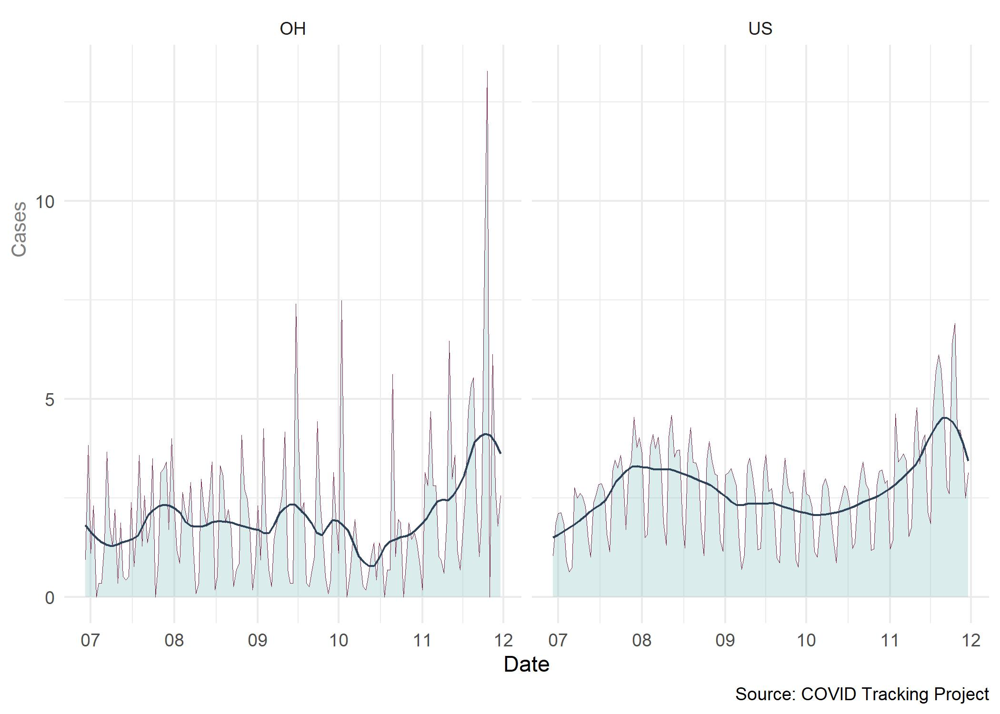

The COVID Tracking Project is a volunteer organization initiated by _The Atlantic_ for the purpose of collecting and publishing national trends necessary to understand COVID-19 outbreaks throughout the United States.^[The COVID Tracking Project. (2020). Retrieved 13 December 2020, from https://covidtracking.com/] 

During the early months of the pandemic, Ohio's rate of infections and overall trends in change over time were trended lower than national average. The following graph of reported infections per 100,000 population since July shows that since mid October infection rates have increased at a much more dramatic rate than national average.^[Trump Sits Out Debut of Covid-19 Vaccine That He Long Championed. (2020). Retrieved 16 December 2020, from https://www.msn.com/en-us/news/politics/trump-sits-out-debut-of-covid-19-vaccine-that-he-long-championed/ar-BB1bY8rA?ocid=msedgntp]

```{r setup, include=FALSE}
knitr::opts_chunk$set(echo = FALSE)
```

# COVID-19 Infections Over Time

```{r echo=FALSE, fig.align ='right', layout = "l-page", fig.cap="Source: Covid Tracking Project"}

```

Similarly, a review of hospitalization rates per 100,000 shows alarming increases that also exceed national trends. While no can forecast with accuracy how infection rates will change over the next several months, there is significant cause for concern and the number of Ohio hospitalizations in November and December suggests that demand for acute hospital services for COVID-19 patients may exceed capacity in some of the more affected areas.

# COVID-19 Hospitalizations Over Time

```{r echo=FALSE, fig.align ='right', layout = "l-page", fig.cap="Source: Covid Tracking Project"}

```

# COVID-19 Deaths Over Time

Fortunately for Ohio, the death rate per 100,000 population remains at or below national average. However, since mid-October Ohio deaths have increased at a more rapid rate and are now approaching the national average. 

```{r echo=FALSE, fig.align ='right', layout = "l-page", fig.cap="Source: Covid Tracking Project"}

```

Distill is a publication format for scientific and technical writing, native to the web.

Learn more about using Distill at <https://rstudio.github.io/distill>.


