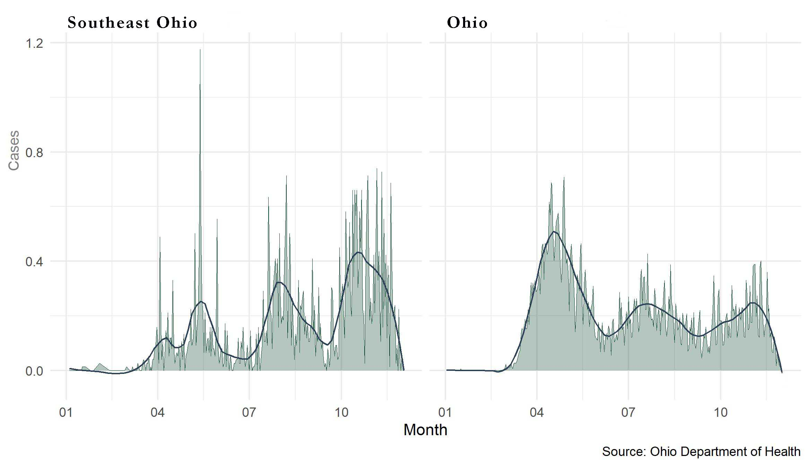

```{r setup, include=FALSE}
knitr::opts_chunk$set(echo = TRUE, dev="svg", fig.retina = 3, fig.align = "center")
```

```{r echo=FALSE, fig.align ='center', layout = "l-page"}

```

Southeast Ohio is a region of tremendous physical beauty, but also home to deeply entrenched multi-generational poverty. Recent data suggest the area may also be an emerging hotspot for COVID-19. 

The rate of infection for the region is now virtually identical to the remainder of the state. That in itself would be cause for concern, but a review of recent hospitalization trends shows that admissions are now about 50 percent higher than the rest Ohio. 

There have been three distinct waves of COVID-19 transmission throughout the state. Overall, deaths have been lower in the second and third wave. While COVID-19 deaths were much initially lower in Southeast Ohio than the remainder the state, deaths have steadily increased throughout the region. 

Lower initial rates throughout the region may have resulted in a degree of complacency. Disproportionate numbers of area poor residents who have underlying conditions combined with disregard for basic COVID-19 health practices could cause unnecessary loss of life in Southeast Ohio and other rural communities across the state. These data were extracted from the Ohio Department of Health COVID-19 Dashboard.^[COVID-19. (2020). Retrieved 6 December 2020, from https://coronavirus.ohio.gov/wps/portal/gov/covid-19/home]


# Covid-19 Deaths Over Time


```{r echo=FALSE, fig.align ='center', layout = "l-page", preview = TRUE, out.width = '110%'}

```