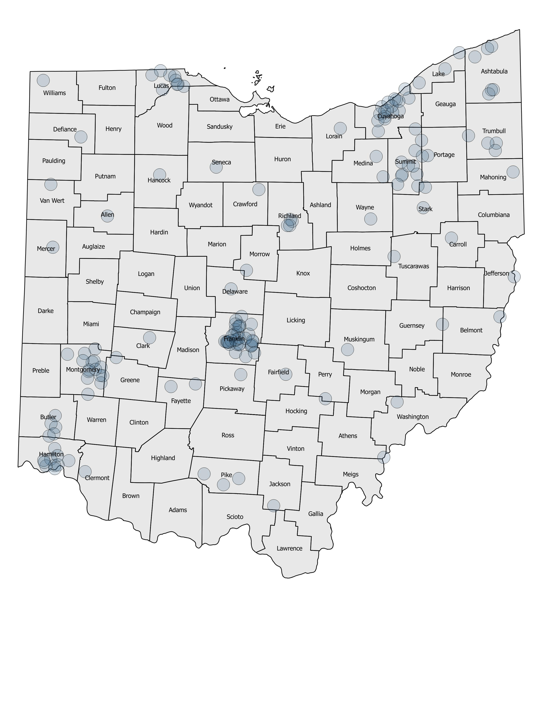

```{r setup, include=FALSE}
knitr::opts_chunk$set(echo = TRUE, dev="svg", fig.retina = 3, fig.align = "center")
```


```{r echo=FALSE, fig.align ='right', layout = "l-page", fig.cap="Ohio Statehouse"}
knitr::include_graphics("levlong.jpg")
```

The Ohio Alliance for Innovation in Population Health obtained data from the _Washington Post_ police shootings database^[Retrieved 22 December 2020, from https://www.washingtonpost.com/national/how-thewashington-
post-is-examining-police-shootings-in-the-united-states/2016/07/07/d9c52238-43ad-11e6-
8856-f26de2537a9d_story.html] for the U.S. covering the period beginning January 1st, 2015 through January 4th, 2021. The Post database tracks more than a dozen data elements per fatality – including race of decedent, the circumstances of the shooting, whether the person was armed and whether the person was experiencing a mental health crisis.
 
Our analysis of the Post's data shows there were 169 Ohio fatalities for an average annual death rate per million population of 2.41, which is lower than the national annual rate of 2.99. At 5.01 deaths per 1 million, Franklin County ranked 13th among the 100 most populous counties in the United States. Cuyahoga and Hamilton ranked 57th and 59th respectively. 
Our analysis also suggests that police intervention fatalities may be higher in rural areas than in the urban centers. For a more detailed analysis look for the upcoming Police Intervention Fatality monograph that the Alliance will release later in January.


```{r, echo=FALSE, fig.align ='center', out.width = '100%',fig.cap="Map of Police Shooting Fatalities by County, 2015 - Jan 4, 2021"}

```


