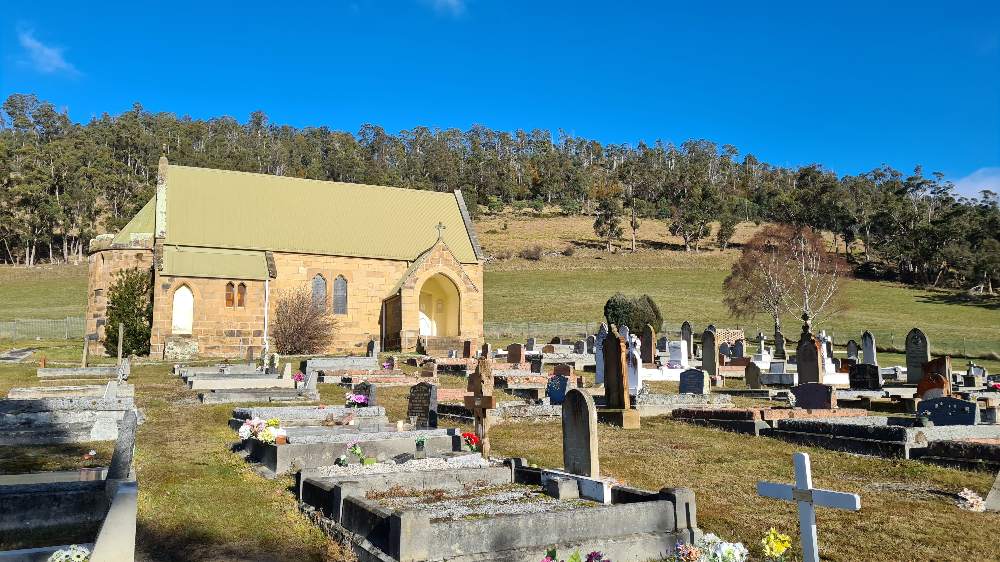

```{r setup, include=FALSE}
knitr::opts_chunk$set(echo = FALSE)
```

```{r, preview = TRUE}

```

Poor people can not afford to die. We do a terrible job of supporting poor people when they are alive. It should not be surprising that we do even less when they die. Average funeral costs can vary between \$6000 and \$10,000. Most low-income families struggle just to meet basic needs. It is not uncommon for poor families facing the death of a loved one to be forced to do community fund raisers or secure large loans that they can't afford to pay back.

Currently in Ohio, municipalities and townships have the responsibility to deal with indigent burials as outlined in ORC Section 9.15. There are specific guidelines that explain their responsibilities and limitations. The law includes a definition of poverty as having an income below 150% of the Federal Poverty Level. The income limit can apply to the deceased or the claimant of the body. As of the most recently state budget, the Ohio has created a new reimbursement program to help offset the costs of indigent burials to local governments.  The program is administered by the Ohio Funeral Directors and Embalmers Licensing Board. The Rules are spelled out in Ohio Administrative Code 4717-17. Reimbursements are limited to \$1000 for adults and \$750  for  burial costs and does not cover other funeral expenses.

One million dollars is appropriated for each year of the biennium. Very little of this money has been spent. Many local governments have made no attempt to advise the public of this program. Funeral Directors are not required to inform families of this assistance. Many don’t. This issue is even more relevent during this pandemic. There are more people who are poor and they are disproportionately more like to die. Yet very few get the help they need. Prior to the pandemic Ohio averaged about 120,000 deaths a year. 24% of Ohio households have incomes below 150% of the poverty level. It would be reasonable to assume that approximately 28,000 deaths per year might be eligible for indigent burial assistance. That would greatly exceed the annual appropriation for indigent burial reimbursement.  Since mortality rates are higher and incomes lower in our inner city and Appalachian communities their needs are more severe.

The Federal government offers a modest $255 death benefits through for Social Security recipients. The Veterans Administration offer some funeral assistance to former service members. Recently the Federal Emergency Management Agency was awarded COVID relief funding to help pay for indigent burial during the health emergency, we are waiting for details.

Meanwhile low-income families continue to struggle to cope with the both the emotional and financial costs of the death of loved ones. We need to increase the reimbursement for burials, do a better job of educating the public about this assistance, consider reducing burial costs by promoting more natural burials, and treat every death with the respect it deserves.

